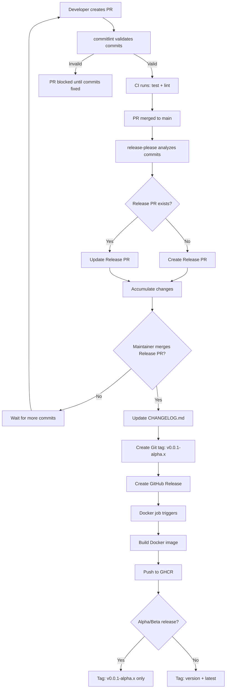

# JWT Authentication Service

[](https://github.com/klazomenai/jwt-auth-service/actions/workflows/ci.yaml)
[](https://github.com/klazomenai/jwt-auth-service)
[](https://opensource.org/licenses/MIT)
[](https://goreportcard.com/report/github.com/klazomenai/jwt-auth-service)

Generic JWT token service with RS256 signing and Redis-backed revocation tracking.

> **⚠️ Alpha Status**: This project is in alpha (v0.0.1-alpha). Not recommended for production use. See [Known Limitations](#known-limitations-alpha) below.

## Table of Contents

- [Features](#features)
- [Quick Start](#quick-start)
- [Installation](#installation)
- [Configuration](#configuration)
- [API Reference](#api-reference)
- [Development](#development)
- [Architecture](#architecture)
- [Known Limitations](#known-limitations-alpha)
- [Roadmap](#roadmap)
- [Contributing](#contributing)
- [Security](#security)
- [License](#license)

## Features

- **RS256 JWT Tokens**: Asymmetric signing with RSA key pairs
- **Parent/Child Token Architecture**: Long-lived parent tokens (30 days) + short-lived child tokens (15 minutes)
- **Server-Side Auto-Renewal**: Background worker automatically generates new child tokens before expiry
- **Token Revocation**: Redis-backed revocation tracking with user-level and token-level revocation
- **JWKS Endpoint**: Public key distribution for JWT validation
- **RESTful API**: Complete token lifecycle management
- **Streaming Updates**: Server-Sent Events (SSE) for real-time token renewal notifications
- **Health Checks**: HTTP health endpoint
- **External Authorization**: Integration endpoint for Envoy/Istio external auth

## Quick Start

### Docker

```bash
docker run -d \
  -p 8080:8080 \
  -e JWT_ISSUER=https://auth.example.com \
  -e JWT_AUDIENCE=my-api \
  -e REDIS_ADDR=redis:6379 \
  ghcr.io/klazomenai/jwt-auth-service:v0.0.1-alpha
```

### Go Install

```bash
go install github.com/klazomenai/jwt-auth-service/cmd/server@v0.0.1-alpha
```

### From Source

```bash
git clone https://github.com/klazomenai/jwt-auth-service.git
cd jwt-auth-service
make build
./bin/jwt-service
```

## Installation

### Prerequisites

- Go 1.22 or later
- Redis 7+ (for revocation tracking)

### Build from Source

```bash
# Clone repository
git clone https://github.com/klazomenai/jwt-auth-service.git
cd jwt-auth-service

# Install dependencies
make deps

# Run tests
make test

# Build binary
make build

# Binary output: bin/jwt-service
```

### Docker

```bash
# Build image
make docker-build IMAGE_TAG=v0.0.1-alpha

# Or pull from GitHub Container Registry
docker pull ghcr.io/klazomenai/jwt-auth-service:v0.0.1-alpha
```

## Configuration

### Required Environment Variables

| Variable | Description | Example |
|----------|-------------|---------|
| `JWT_ISSUER` | JWT issuer claim | `https://auth.example.com` |
| `JWT_AUDIENCE` | JWT audience claim | `my-api` |

### Optional Environment Variables

| Variable | Default | Description |
|----------|---------|-------------|
| `PORT` | `8080` | HTTP server port |
| `REDIS_ADDR` | `redis:6379` | Redis server address |
| `REDIS_PASSWORD` | `` | Redis authentication password |
| `PRIVATE_KEY_PATH` | `/etc/jwt-service/private-key.pem` | RSA private key path |
| `PUBLIC_KEY_PATH` | `/etc/jwt-service/public-key.pem` | RSA public key path |
| `AUTO_RENEW_THRESHOLD_SECONDS` | `120` | Renew tokens within this many seconds of expiry |
| `AUTO_RENEW_WORKER_INTERVAL` | `30` | Check for renewals every N seconds |

### Example Configuration

```bash
export JWT_ISSUER=https://localhost
export JWT_AUDIENCE=test-api
export REDIS_ADDR=localhost:6379
export AUTO_RENEW_THRESHOLD_SECONDS=120
./jwt-server
```

## API Reference

### Token Management

#### Create Single Token

```bash
POST /tokens
Content-Type: application/json

{
  "user_id": "user123",
  "network": "mainnet",
  "rate_limit": 100,
  "expires_in": 3600
}
```

#### Create Token Pair (Parent + Child)

```bash
POST /token-pairs
Content-Type: application/json

{
  "user_id": "user123",
  "network": "mainnet",
  "rate_limit": 100,
  "parent_expires_in": 2592000,
  "child_expires_in": 900,
  "include_child": true
}
```

#### Manual Child Token Renewal

```bash
POST /renew
Content-Type: application/json

{
  "parent_token": "<parent-jwt-token>"
}
```

#### Revoke Token

```bash
DELETE /tokens/:tokenID
```

#### Revoke All User Tokens

```bash
DELETE /users/:userID/tokens
```

### Auto-Renewal

#### Poll for Latest Child Token

```bash
GET /tokens/latest?parent_jti=<parent-jti>
```

#### Stream Token Updates (SSE)

```bash
GET /tokens/stream?parent_jti=<parent-jti>
```

### Service Endpoints

#### JWKS (Public Key)

```bash
GET /.well-known/jwks.json
```

#### Health Check

```bash
GET /health
```

#### Prometheus Metrics

```bash
GET /metrics
```

Returns Prometheus-formatted metrics for monitoring token lifecycle:

| Metric | Type | Labels | Description |
|--------|------|--------|-------------|
| `jwt_parent_token_expiry_timestamp_seconds` | Gauge | user_id, network, parent_jti | Unix timestamp when parent token expires |
| `jwt_parent_token_issued_timestamp_seconds` | Gauge | user_id, network, parent_jti | Unix timestamp when parent token was issued |
| `jwt_parent_tokens_active_total` | Gauge | - | Total number of active parent tokens |
| `jwt_revoked_tokens_total` | Gauge | - | Total number of revoked tokens |

#### External Authorization (Envoy/Istio)

```bash
POST /authorize
Authorization: Bearer <token>
```

Returns `200 OK` if valid, `401/403` if invalid or revoked.

## Development

### Setup

```bash
# Install dependencies
make deps

# Run tests
make test

# Run tests with coverage
make test-verbose

# Run linters
make lint

# Build binary
make build
```

### Testing

```bash
# Run all tests
make test

# Run with coverage report
make test-coverage

# View coverage in browser
open coverage.html
```

### Code Style

This project follows standard Go conventions. Run `make lint` before submitting PRs.

See [CONTRIBUTING.md](CONTRIBUTING.md) for detailed development guidelines.

## Architecture

### Parent/Child Token Model

- **Parent Tokens**: Long-lived tokens used to generate child tokens (not used directly for API requests)
- **Child Tokens**: Short-lived tokens used for actual API requests
- **Auto-Renewal**: Server-side worker automatically generates new child tokens before expiry

### Storage Layer

Redis is used for:
- Token revocation tracking
- Auto-renewal configuration storage
- Latest child token storage

The storage layer is abstracted through the `storage.Store` interface for future extensibility.

### Token Flow

```
1. Client requests parent token → Service generates parent + optional child
2. Client uses child token for API requests
3. Server auto-renewal worker monitors expiry
4. Worker generates new child token before expiry
5. Client polls /tokens/latest or streams /tokens/stream for updates
6. Client switches to new child token before old expires
```

### Components

- `cmd/server/` - HTTP server initialization
- `pkg/auth/` - JWT signing, validation, key management
- `pkg/api/` - HTTP handlers for token operations
- `pkg/storage/` - Redis-backed storage interface
- `pkg/renewal/` - Auto-renewal worker

## Known Limitations (Alpha)

This alpha release has the following limitations:

### Security

- Single RSA key stored in emptyDir (production should use secure secret storage)
- No automated key rotation
- No rate limiting enforcement on endpoints

### Architecture

- **Parent/Child Token Claims Incomplete**: Child tokens created via renewal do not include `token_type: "child"` and `parent_jti` claims
- **No Parent Revocation Cascade**: Revoking parent token does not automatically revoke child tokens
- Authorization endpoint does not validate parent token status for child tokens

See [../JWT-PARENT-CHILD-TECHNICAL-GAPS.md](../JWT-PARENT-CHILD-TECHNICAL-GAPS.md) for complete analysis.

### Operational

- In-memory auto-renewal state (Redis, not distributed)
- Single replica deployments only
- No payload size validation
- No circuit breaker pattern

### Testing

- 28.7% overall test coverage (target: >70% for beta)
- No integration tests included in this repository

Do not use in production until beta status. See [SECURITY.md](SECURITY.md) for deployment considerations.

## Roadmap

### Beta (v0.1.0) - Planned

- Fix parent/child token claims (add `token_type` and `parent_jti`)
- Implement parent revocation cascade
- Add rate limiting enforcement
- Secure secret storage integration for RSA keys
- Increased test coverage (>70%)
- Integration test suite
- Health checks with syncing state awareness

### Future Enhancements

- Blockchain-backed revocation storage (Web3 integration)
- Smart contract integration for decentralized revocation
- Automated key rotation
- Multi-signature revocation support
- Circuit breaker pattern for resilience
- Distributed auto-renewal state (Redis Cluster)

See [CHANGELOG.md](CHANGELOG.md) for release history.

## Release Workflow

This project uses [release-please](https://github.com/googleapis/release-please) for automated releases with [Conventional Commits](https://www.conventionalcommits.org/).



## Contributing

Contributions are welcome! This project is in active development.

Before contributing:

1. Read [CONTRIBUTING.md](CONTRIBUTING.md) for development guidelines
2. Read [CODE_OF_CONDUCT.md](CODE_OF_CONDUCT.md) for community standards
3. Check existing issues and PRs to avoid duplicates
4. Follow [Conventional Commits](https://www.conventionalcommits.org/) for commit messages

### How to Contribute

- Report bugs using the issue tracker
- Suggest features via feature request template
- Submit pull requests with tests
- Improve documentation
- Help answer questions in discussions

## Security

Security vulnerabilities should be reported privately. See [SECURITY.md](SECURITY.md) for:

- Supported versions
- How to report vulnerabilities
- Response timeline
- Security best practices
- Known security limitations

Do NOT report security issues through public GitHub issues.

## License

This project is licensed under the MIT License - see [LICENSE](LICENSE) file for details.

## Acknowledgments

This service was extracted from the [helm-priv-deploy-autonity](https://github.com/clearmatics/helm-priv-deploy-autonity) project to provide a standalone, reusable JWT authentication service.

Designed for use with Istio service mesh and Envoy proxy external authorization.

## Links

- [GitHub Repository](https://github.com/klazomenai/jwt-auth-service)
- [Issue Tracker](https://github.com/klazomenai/jwt-auth-service/issues)
- [Releases](https://github.com/klazomenai/jwt-auth-service/releases)
- [Contributing Guidelines](CONTRIBUTING.md)
- [Security Policy](SECURITY.md)
- [Code of Conduct](CODE_OF_CONDUCT.md)
